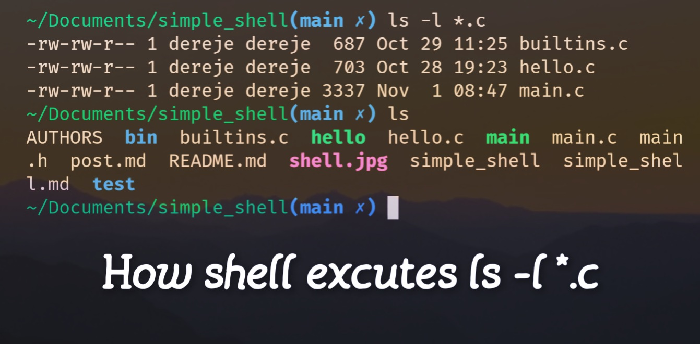

# How shell executes `ls -l *.c`

In this post we'll talk about how shell executes command `ls -l *.c`. Moreover, we'll also discus how it is implemented under the hood.

We strongly advise you to have at least fundamental knowlege of C programming language and Linux system programming before you continue.

Note that we skipped many error check and memory management for brevity which are must be included in working version of the code. Refer [here](github.com/dere7/simple_shell/) for implemention.

When we open a shell(_users perspective_) it prompts us to enter a line of command and when we enter the command it executes our command and it prompts us to enter another command.

But there is more to this story. The following are simplfied version of steps the shell takes. The shell:

1. prints the prompt and waits for input. Let us assume we entered `ls -l *.c`. This is preformed using `getline()`.

```c
while(1) {
	char *line = NULL;
	size_t len = 0, nline;
	printf("$ ");
	nline = getline(&line, &len, stdin);
	if(nline == -1) return 0;
	// continues here
}
```

2. splits this line of command into tokens. In our case `ls`, `-l`and `*.c`. this uses `strtok(command, DELIM)` where DELIM is string consisting whitespaces character(spaces, tabs and etc.).

```c
// continued
const char *DELIM =  " \t\a\r"
token = strtok(line, DELIM);
while(token != NULL) {
	tokens[pos++] = strup(token); // push to array of strings
	token = strtok(NULL, DELIM);
}
```

3. looks for expansion in our case token `*.c` matches every file ending in `.c`.
4. Checks if the first token is aliased. if it is it replaces it with the orginal expanded version.
   In our case `ls` is aliased to `ls --colory=tty`.
5. checks if the command is builtin(like `exit`, `cd`, `help` ... etc). `ls` is not builtin command.
6. If the command is not builtin command it searches the command in the `PATH` enviromental variable. `ls` is found in path `/bin/ls`.
7. Creates new process using syscall `fork()`.
```c
int status;
pid_t child_pid = fork();
if (child_pid == -1)
	return (1);

if (child_pid == 0) // if this is child process execute
{
	if (execve(tokens[0], tokens, __environ) == -1)
		return (1);
} else // if it is parent wait for child
	wait(&status);
```
8. Finaly it executes it. It uses `execve(tokens[0], tokens, env)` system call. See step 7. and continues at step 1 again.

## Conclusion

This is just simple illustration of how shell goes on executing commands like `ls -l *.c`. But now days shells has evolved to do much complex tasks like history, conditional statements, loops and any other things programming languages supports. It was quite journey learning shell and we do believe you can benfit be implementing those concepts in yourself. You can find our implementation in **C** [here](github.com/dere7/simple_shell/). Thanks :)
